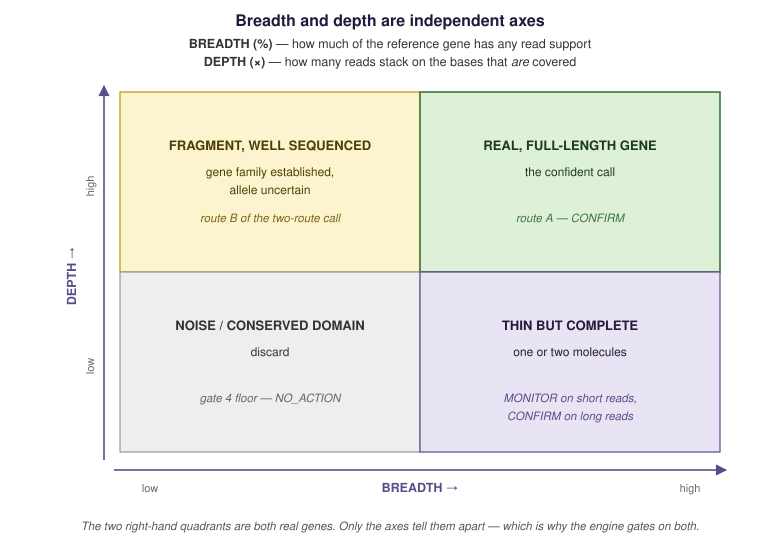

# Metagenomic Threat Triage — a 101

**What this document is.** A single, self-contained introduction to why this project exists, what
the triage pipeline does, how every one of its decision gates works and why it is set where it is,
and what happened when it was run against three very different datasets.

**Who it is for.** Someone technical who has never worked with metagenomics. You do not need
biology background. Part 1 gives you the vocabulary; everything after it builds on Part 1 only.

**How to read it.** Start to finish is about 45 minutes. If you only have ten:

| You want | Read |
|---|---|
| The idea in one page | [Part 2 — Why this exists](#part-2--why-this-exists) |
| What the software does | [Part 3 — Architecture](#part-3--architecture) |
| Every rule and its rationale | [Part 4 — The gates](#part-4--the-gates-one-by-one) |
| Does it actually work | [Part 6.2 — The Zymo standard](#62-test-case-2--the-zymo-standard-known-truth) |
| To run it | [Part 8 — Try it](#part-8--try-it) |

Every hard number in this document is confined to a marked table that names the file it comes
from, so when a threshold moves you can see what needs updating. Exhaustive detail lives in
[`docs/`](docs/) and is linked from the relevant section.

---

## Table of contents

- [Part 1 — Metagenomics in fifteen minutes](#part-1--metagenomics-in-fifteen-minutes)
- [Part 2 — Why this exists](#part-2--why-this-exists)
- [Part 3 — Architecture](#part-3--architecture)
- [Part 4 — The gates, one by one](#part-4--the-gates-one-by-one)
- [Part 5 — Every threshold in one table](#part-5--every-threshold-in-one-table)
- [Part 6 — Three test cases](#part-6--three-test-cases)
- [Part 7 — What this cannot do](#part-7--what-this-cannot-do)
- [Part 8 — Try it](#part-8--try-it)
- [Glossary](#glossary)
- [References](#references)

---

# Part 1 — Metagenomics in fifteen minutes

## 1.1 What a shotgun metagenomic run actually is

You swab a surface. Whatever DNA is on that swab — from bacteria, fungi, viruses, human skin
cells, and things nobody has ever sequenced — goes into a tube. A sequencing machine reads
fragments of all of it at once, with no target and no preference. That is what **shotgun** means:
you are not looking for anything in particular, you are reading everything and sorting it out
afterwards.

The machine does not hand you organisms. It hands you tens of millions of short strings of
`ACGT`, called **reads**. Each read is a fragment of one DNA molecule from one cell, and it
arrives with no label saying where it came from.


<sub>**Figure 1** — from swab to report. Source: [`docs/img/pipeline_overview.mmd`](docs/img/pipeline_overview.mmd) — regenerate with `docs/img/render.sh`.</sub>

Two numbers govern everything downstream:

- **Read length.** Short-read platforms (Illumina) give ~50–150 bases per read. Long-read
  platforms (Oxford Nanopore, PacBio) give thousands — this project has one dataset averaging
  6,678 bases. This difference changes what the data *means*, and Part 6.3 is about exactly that.
- **Depth.** How many reads you got. More reads means you can see rarer things.

## 1.2 How reads become a species table

A **classifier** compares each read against a reference database of known genomes. This project's
data comes from the PFI report pipeline, which uses **Kraken2** (Wood 2019) followed by **Bracken**
(Lu 2017). You need to understand what each does, because the difference between them is the first
trap.

**Kraken2** breaks each read into overlapping k-mers (short subsequences, typically 35 bases) and
looks them up in a table built from reference genomes. If a read's k-mers are all unique to
*Escherichia coli*, the read is assigned to *E. coli*. If its k-mers are shared by every member of
the family, the read is assigned to a higher rank — family, or order — because that is as specific
as the evidence allows. Reads assigned this way, at species level, are what the report calls
**Real Read**.

**Bracken** then redistributes. It takes the reads Kraken2 could only place at genus or family
level and pushes them down to species using a statistical model of how reads would be expected to
distribute. Its output is **Estimate Read** (and the **Abundance** percentage derived from it).

Two figures for the same organism, and they mean different things:



<sub>**Figure 2** — Real Read vs Estimate Read. The Estimate is complete but can badly over-count at trace level, so the engine judges trace taxa on Real Read. Source: [`docs/img/read_types.mmd`](docs/img/read_types.mmd).</sub>

> **Trap 1 — the two numbers disagree, and which one is right depends on the situation.**
>
> For a **trace organism**, Bracken inflates. In one sample here, *Escherichia coli* had 62–118
> species-specific reads and a Bracken estimate up to 12,076 — roughly 100× inflation, because
> ambiguous Enterobacteriaceae reads got funnelled into it. Judge on Real Read.
>
> For an **abundant organism with close relatives**, Real Read deflates. In the certified Zymo
> standard, *Pseudomonas aeruginosa* is present at a known 12% but holds only 1.55%
> species-specific reads, because its congeners absorb the rest. Judge on Abundance.
>
> The pipeline handles both directions. See [gate 7](#gate-7--bracken-inflation) and
> [`docs/zymo_validation.md`](docs/zymo_validation.md) defect D5.

## 1.3 The unclassified pile

A large fraction of reads match nothing. In this project's transport-hub swabs, **72–90%** of
reads were unclassified. That is not a failed run.

Two independent reasons:

1. **The world is not in the database.** The NYC subway survey (Afshinnekoo 2015) left 48% of
   reads unmatched against a comprehensive reference. MetaSUB catalogued over 12,000 taxa absent
   from reference databases across 60 cities (Danko 2021).
2. **The database you chose sets the number.** A clinical pathogen database is deliberately
   narrower than a RefSeq-complete build, so classification rate is a property of the reference
   set as much as of the sample (Nasko 2018; Breitwieser 2019; Gu 2019).

The report says nothing about what is in that bin — it gives only the count. Anything absent from
the PFI database lands here and is invisible to every downstream verdict, which makes it the single
largest blind spot in an HTML-only reading. Interrogating it needs the raw reads. (This project did
so once, outside the triage engine: GC spectrum plus over-represented 25-mers across all five HTX
samples found no dominant unknown organism, top k-mers at 0.01–0.02%.)

## 1.4 Host DNA

If a human touched the surface, most of the DNA is human. The pipeline removes it, but what is
removed is gone from your denominator. One sample here was **91.28% host**, leaving 622,642
classified reads out of 45 million raw — about five times less microbial data than a sibling
sample. A short hit list from that sample is a sensitivity limit, not a clean surface.

## 1.5 Resistance genes: breadth and depth

Alongside taxonomy, the report screens reads against **MEGARes** (Doster 2020), a database of
antimicrobial resistance genes, and **VFDB** (Liu 2022), a database of virulence factors.

MEGARes has a hierarchy you must hold in your head:



<sub>**Figure 3** — The MEGARes hierarchy. One `MEG_` accession is one reference allele, not one gene. Source: [`docs/img/megares_hierarchy.mmd`](docs/img/megares_hierarchy.mmd).</sub>

**A `MEG_` number is not a gene. It is one reference allele of a gene**, and MEGARes stores many
near-identical alleles per gene. One real *mecA* gene in your sample will recruit reads onto three
or four `MEG_` accessions simultaneously. Counting those rows counts the same gene several times.

Each hit comes with two independent measurements:



<sub>**Figure 4** — Breadth and depth are independent axes, because the report gives depth over *covered* bases only. Source: [`docs/img/breadth_depth.svg`](docs/img/breadth_depth.svg).</sub>

> **Trap 2 — breadth and depth are independent, because depth is reported over *covered* bases.**
>
> A gene can sit at 11.69× depth across only 60% of a reference allele. That is not a weak hit —
> it is a well-sequenced fragment. The gene family is established; the specific allele is not.
> This is why the pipeline has two routes to a confident gene call, not one threshold. See
> [gate 4b](#gate-4b--the-two-route-gene-call).

> **Trap 3 — MEGARes has no organism column.**
>
> The AMR table tells you a resistance gene is *in the sample*. It cannot tell you *which
> organism carries it*. In a sample containing both *Staphylococcus aureus* and abundant
> coagulase-negative staphylococci, "mecA present" does not tell you whose *mecA* it is — and
> methicillin-resistant *S. epidermidis* is an ordinary skin organism, whereas MRSA on a
> check-in kiosk is a different conversation. This project attempted assembly specifically to
> close that gap. It did not close. This limitation is load-bearing for the entire design.

## 1.6 Contamination that comes from the laboratory

Reagents and extraction kits carry their own bacterial DNA. The resulting false signal is called
the **kitome**, and it is well documented (Salter 2014; Eisenhofer 2019). It matters most exactly
where surveillance matters most: low-biomass samples, where there is little real DNA to drown it
out.

> **Trap 4 — without a blank extraction control, the contamination floor is asserted, not
> measured.** No blank was run in this project's batches. The pipeline therefore uses a
> hard-coded list of 20 known kitome genera and, where possible, a cross-sample enrichment test —
> both of which are weaker than an actual negative control.

## 1.7 Is anything alive?

No. DNA comes off a dry surface from live cells, dead cells and spores alike. Nothing in a DNA-only
run distinguishes them. The PFI report has an "active species" table; it requires an RNA library
and is **empty by construction** in every dataset here.

---

# Part 2 — Why this exists

## 2.1 The problem: a report nobody can read

A single PFI report for one swab contains:

- a species table with up to ~27,000 possible organisms, of which several hundred to a thousand
  are called
- hundreds of MEGARes resistance rows, split across near-identical alleles
- hundreds to thousands of VFDB virulence rows, each attributed to a reference *strain*

Multiply by a batch. A human analyst reading this carefully takes days per batch, and the reading
is not reproducible: two analysts produce two answers, and neither can show you the rule they
applied.

Meanwhile almost everything in the report is background. In one sample here, 72 resistance rows
reduced to **2** calls worth acting on. The signal-to-noise problem is the whole problem.

## 2.2 The cautionary tale

In 2015 the NYC subway metagenomics study (PathoMap) reported *Bacillus anthracis* and *Yersinia
pestis* on transit surfaces. Both calls were retracted in a published correction (*Cell Systems*
1(1):97) — they did not survive re-analysis. The organisms were not there; trace, ambiguous reads
had been read as detections.

That is the exact failure this pipeline is built to prevent, and it is why several gates exist
purely to *reject* things:

- 11 reads of *Clostridium botulinum* that collapse to **one unique sequence** — an amplification
  artifact, not an organism ([gate 6](#gate-6--amplification))
- *Bacillus cereus* genuinely present, and excluded as anthrax at the plasmid level because zero
  pXO1 and zero pXO2 markers are present ([gate 10a](#gate-10a--confirmatory-marker-two-way))
- "*Brucella anthropi*" flagged with a "Human Infection: Y" label in every sample — which is
  *Ochrobactrum anthropi*, renamed into the *Brucella* genus in 2020, a ubiquitous reagent
  contaminant and not brucellosis ([gate 11](#gate-11--taxonomy-currency))

Each of those, taken at face value, triggers an unnecessary escalation.

## 2.3 Why the answer is rules, not a language model

The pipeline contains **no LLM and no machine learning**. That is a deliberate design choice, and
it rests on three arguments:

1. **The output may become evidence.** A biosurveillance verdict can drive a public-health
   response. Every verdict must carry the rule and the numbers that produced it, and must be
   identical on re-run. A deterministic cascade gives you that; a sampled model does not.
2. **There is no training set.** Five unlabelled samples is not data you can learn from. The
   knowledge here is published biology — which plasmid distinguishes anthrax from *B. cereus*,
   which genes are intrinsic to which genus — and published biology belongs in a rule file where
   it can be read and disputed, not in weights.
3. **The hard part is not classification anyway.** The genuinely undecidable questions — which
   organism carries a resistance gene, whether a trace call is contamination, whether anything is
   alive — are undecidable *from this data*. No model fixes a missing measurement.

Full argument: [`docs/automated_triage_design.md`](docs/automated_triage_design.md).

## 2.4 What "triage" means here

Triage is not diagnosis. The pipeline sorts findings into tiers of *what a human should do next*.
The terminal state for a real finding is **CONFIRM — culture with antibiotic susceptibility
testing**, not "this sample is resistant".

Three design commitments follow, and they are the ones to remember:

| Commitment | Why |
|---|---|
| **Tiers, never diagnoses.** | The data supports "worth a laboratory's time", not "this is what it is". |
| **`NOT_TESTED` never collapses into `NO_ACTION`.** | Two ways a test fails to run: an RNA virus against a DNA library was never screened, and a confirmatory marker at too little coverage was never assessable. Absence of evidence is not evidence of absence, and the tier system must make that impossible to confuse. |
| **An AMR gene with no attributed host caps at `CONFIRM`.** | Host attribution is unsolved here ([Trap 3](#15-resistance-genes-breadth-and-depth)). No rule fixes a missing measurement. |

---

# Part 3 — Architecture

## 3.1 The shape of it



<sub>**Figure 5** — pipeline architecture: what reads what, and where the rules live. Source: [`docs/img/architecture.mmd`](docs/img/architecture.mmd) — regenerate with `docs/img/render.sh`.</sub>

**Separation of engine and knowledge is the central structural decision.** `triage.py` holds
mechanism — how to collapse alleles, how to compare samples, how to apply a threshold. Every
biological claim, every threshold and every organism list lives in `triage_rules.json`, in JSON,
with a `why` field where the choice is not obvious. A microbiologist can audit and change the
biology without reading Python.

The engine is Python 3 standard library only. No `pip install`, no reference database, no aligner.
It reads the HTML report the PFI pipeline already produced.

## 3.2 Two vocabularies, and they are not the same

This confuses people, so it is worth being explicit. There are **row tiers** (per organism, per
gene) and a separate **sample verdict** (one answer for the whole swab).



<sub>**Figure 6** — Two vocabularies. Row tiers describe one organism or one gene; the sample verdict is the roll-up. `NOT_TESTED` sits outside both. Source: [`docs/img/tiers.mmd`](docs/img/tiers.mmd).</sub>

Note that **INVESTIGATE exists only at sample level** — no individual row is ever labelled
INVESTIGATE — and **ESCALATE means different things in the two ladders**. The HTML report carries
both legends side by side for this reason.

## 3.3 Two organism lists, two ceilings

| List | Size | Source | Ceiling | Escalates on |
|---|---:|---|---|---|
| `threat_list` | 46 | CDC Category A / B / C bioterrorism agents | `ESCALATE` | a confirmatory marker gene |
| `clinical_watchlist` | 24 | WHO Bacterial Priority Pathogens List + ESKAPE | `CONFIRM` | enrichment + co-located acquired resistance |

The watchlist exists because a CDC-only threat list has a blind spot: *Acinetobacter baumannii* is
not a bioterrorism agent, so on the CDC list alone it could never exceed `MONITOR` — and it was
the most operationally important organism in the HTX batch. The watchlist gives such organisms a
route to `CONFIRM` while keeping `ESCALATE` reserved for a declared threat agent with its marker.

`threat_list` composition: 20 Category A, 18 Category B, 8 Category C; 21 DNA genomes, 25 RNA.
That RNA/DNA split matters enormously — see [gate 2](#gate-2--assay-detectability).

---

# Part 4 — The gates, one by one

Twelve gates. Gate numbers are historical (they match
[`docs/automated_triage_design.md`](docs/automated_triage_design.md)); the order below is
**execution order**, which is what you need to follow the logic.



<sub>**Figure 7** — the gate cascade. Two paths, one roll-up. Source: [`docs/img/gate_cascade.mmd`](docs/img/gate_cascade.mmd) — regenerate with `docs/img/render.sh`.</sub>

---

### Gate 12 — Input integrity

**Asks:** can this report be trusted at all?

**Rule.** The read partition must sum: `unclassified + classified == clean`. The sample's FASTQ
files must exist and be non-empty.

**Why.** Everything downstream is arithmetic on these numbers. If they do not reconcile, no
verdict below is worth reading, and the correct action is to fix the delivery, not to interpret
the output.

**What it taught us.** The first version cried wolf. A report delivered without its FASTQs
produced four separate "missing file" failures, which reads as a corrupt run. It is not — it is a
normal delivery of a report without raw data. The gate now distinguishes **"not delivered"** (one
NOTE line, two downstream gates skip themselves and say so) from **"delivered broken"** (a real
failure). Honest failure reporting is itself a design requirement: a gate that cries wolf gets
ignored, which is worse than not having it.

---

### Gate 3 — Allele collapsing

**Asks:** how many genes are actually here?

**Rule.** Group all MEGARes rows by `GROUP`. The representative call is the allele highest on
**both** breadth and depth. The rest are partial cross-mapping of the same read pool.

**Why.** [Trap 3's sibling](#15-resistance-genes-breadth-and-depth): one real gene recruits reads
onto several near-identical accessions. Reporting them as separate findings inflates the
resistance burden.

**Worked example** — one sample's *mecA*/CTX-M rows:

| Group | Accession | Coverage | Depth | Reading |
|---|---|---:|---:|---|
| MECA | MEG_3778 | 90.89% | 10.51× | **Best allele — the representative call** |
| MECA | MEG_3780 | 59.77% | 2.83× | Partial cross-mapping of the same read pool |
| MECA | MEG_3770 | 58.52% | 6.68× | Same — not an additional *mecA* gene |
| CTX | MEG_2430 | 82.88% | 7.25× | **Best allele of the blaCTX-M family** |
| CTX | MEG_2435 | 54.14% | 2.71× | Partial cross-mapping onto a second allele |

Five rows, two genes. The same collapsing applies to VFDB: in one sample, 326 raw virulence rows
for *A. baumannii* collapsed to **121 distinct factors** across 15 reference strains (one factor,
`plc1`, appearing on 8 of them) — a 2.7× overstatement if you count rows.

---

### Gate 4 — Breadth floor

**Asks:** is this a gene, or a conserved fragment of one?

**Rule.** Breadth below **50%** → `NO_ACTION`.

**Why.** Many resistance genes contain domains conserved across unrelated protein families. A read
pile-up on 20% of a reference is far more likely to be that shared domain than the gene.

---

### Gate 5 — Class annotation

**Asks:** what kind of gene is this, and does its presence mean anything?

This is the gate that does the most work, and the reasoning behind it is the least obvious.

**Rule.** Every MEGARes group resolves to one of eight classes, by a three-step cascade:



<sub>**Figure 8** — Gate 5 class annotation — three ordered sources, and an honest miss counter. Source: [`docs/img/class_annotation.mmd`](docs/img/class_annotation.mmd).</sub>

| Class | Meaning | Verdict |
|---|---|---|
| `acquired` | Horizontally acquired — plasmid, transposon, integron | goes to the two-route call |
| `intrinsic` | Chromosomal and normal for this genus | `NO_ACTION` — presence is the default state |
| `efflux_ubiquitous` | Efflux pump present in essentially everything | `NO_ACTION` |
| `point_mutation` | Resistance requires a *variant*, not the gene | `NO_ACTION` |
| `rrna_conserved` | Ribosomal — conserved across all bacteria | `NO_ACTION` |
| `core_essential` | Gene the organism cannot live without | `NO_ACTION` |
| `regulator` | Regulates an operon; needs its partner to mean anything | `NO_ACTION`, or `MONITOR` in one specific case |
| `environmental` | Metal/biocide resistance, not clinically actionable | `NO_ACTION` |

**Why this matters more than any threshold.** Without it, a sample's "resistance burden" is mostly
genes that every bacterium on earth carries. In the HTX samples this gate suppresses roughly 60–70%
of rows, and in the deeper Zymo libraries it suppresses **110 groups per sample**.

**The mechanism map is the scalability story.** The first version hand-wrote group entries and
claimed full coverage. Running the deeper Zymo libraries exposed 315–318 groups per sample, 287 of
them unannotated — the claim had only ever been true at HTX depth. Hand-writing 397 entries is not
maintainable. Classifying by **(Type, Mechanism)** pair instead — 131 pairs span all 397 groups —
is, because a new MEGARes release adds groups far faster than it adds mechanisms.

**The one case where a regulator is worth reporting.** `MONITOR`, not `NO_ACTION`, when the
repressor's *loss of function* is itself the resistance mechanism. `adeN` represses the AdeIJK
efflux pump in *Acinetobacter*; the pump is intrinsic and its presence means nothing, but *adeN*
is the gene whose disruption causes the resistance. Reporting it is the difference between
"intrinsic pump, ignore" and "here is the specific thing worth sequencing deeper". The engine
found *adeN* at 85.76%/8.85× in one HTX sample; the manual analysis had missed it.

---

### Gate 4b — The two-route gene call

**Asks:** is this acquired gene really here?

**Rule.** Two independent routes, because [breadth and depth are independent](#15-resistance-genes-breadth-and-depth):

| Route | Short read | Long read | Reported as |
|---|---|---|---|
| **Full length** | ≥80% breadth **and** ≥5× depth | ≥95% **and** ≥2× | `acquired, full length` |
| **Fragment** | ≥55% **and** ≥10× | ≥80% **and** ≥5× | `acquired, PARTIAL — family established, allele not` |

**Why two routes.** A gene at 11.69× across 60% of a reference allele is well-sequenced evidence of
the gene family. Requiring 80% breadth would discard it; accepting it without the raised depth
requirement would accept noise. Two routes with different depth bars captures both real cases.

**Why the long-read numbers move in opposite directions.** This is the single most counter-intuitive
rule in the pipeline, and it came out of the stool dataset (Part 6.3):

- A 6–8 kb read spans a 1 kb gene end to end, so **breadth saturates**. Measured: 55% of long-read
  AMR rows sit at ≥99% breadth versus 7% of short-read rows. An 80% gate lets everything through —
  hence 95%.
- Conversely **one unit of depth is one whole molecule**, not a thin pileup of 150 bp fragments.
  Demanding 5× would require five reads spanning a gene that one read already covered — hence 2×.
- Two and not one: at the Q10–13 basecall accuracy of that batch, a single read cannot settle an
  allele.

Platform is detected automatically from the report's mean read length (≥1000 bp → long).

**Three genes override the class default**, each with its reason recorded in the rule file:

| Group | Setting | Why |
|---|---|---|
| `CTX` | fragment depth 8× | ESBL is clinically decisive; missing one costs more than over-calling |
| `MECA` | fragment depth 8× | A partial *mecA* still warrants culture |
| `BLAZ` | 85%/8×, fragment route **disabled** | Staphylococcal penicillinase is near-universal background |

---

### Gate 11 — Taxonomy currency

**Asks:** does this name still mean what the analyst thinks it means?

**Rule.** Emit a reclassification note whatever else happens to the row.

**Why.** Bacterial taxonomy is revised constantly, and a rename can turn a harmless organism into
an apparent threat overnight. The example that motivated it: *Ochrobactrum anthropi*, a ubiquitous
reagent contaminant, was moved into the genus *Brucella* in 2020. It now appears as "*Brucella
anthropi*" in all five HTX samples, carrying a **false "Human Infection: Y" flag in every one**.
Taken at face value that is brucellosis at five sites.

---

### Gate 7 — Bracken inflation

**Asks:** which of the two read counts should decide this?

**Rule.** `Estimate Read / Real Read > 10` → flag it, and judge the organism on Real Read.

**Why.** [Trap 1](#12-how-reads-become-a-species-table). Bracken redistribution pushed one trace
*E. coli* call from ~100 species-specific reads to 12,076 estimated. Acting on the estimate means
acting on a model's guess about ambiguous reads.

**The known limit of this gate.** It corrects inflation but not deflation. For an abundant
organism with close relatives the error runs the other way, and Real Read badly under-counts —
measured on the Zymo standard, Real Read gave a mean absolute error of 4.12 percentage points
against Bracken's 1.02. That is defect D5 in
[`docs/zymo_validation.md`](docs/zymo_validation.md), and the correct reading is regime-dependent:
**trace taxa → judge on Real Read; abundant taxa with congeners → judge on Abundance.**

---

### Gate 2 — Assay detectability

**Asks:** could this assay have seen this agent at all?

**Rule.** An RNA-genome agent screened against a DNA-only library → `NOT_TESTED`. **This runs
before the read-count gate**, deliberately.

**Why the ordering is load-bearing.** An RNA virus in a DNA library has zero reads. If the
read-count gate ran first, it would sort it into `NO_ACTION` — indistinguishable from "we looked
and it is not there". It is not there *because nobody looked*.

**25 of the 46 threat-list agents have RNA genomes.** That is every viral haemorrhagic fever
(Ebola, Marburg, Lassa, Junin), the encephalitides, influenza, SARS/MERS, Nipah, Hendra, yellow
fever, chikungunya and tick-borne encephalitis. On a DNA-only run, **more than half the CDC threat
list is structurally invisible.**

**The bug this exposed.** An agent with zero reads never appears in the species table, so the loop
that assigns tiers never reaches it — and the `NOT_TESTED` warning would have reached nobody at
all, the exact collapse into silence the tier exists to prevent. The engine now emits one row per
untestable agent from the rule file rather than from the data, *because the data is what is
missing*. All 25 appear on every report.

---

### Gate 1 — Read floor

**Rule.** Fewer than **50** species-specific reads → below threshold.

**Why.** Below roughly this level, a call is as consistent with cross-mapping or index-hopping as
with presence. It is the crudest gate and it does a lot of work.

---

### Gate 6 — Amplification

**Asks:** are these reads independent molecules, or copies of one?

> **This gate is an optional extension and is off by default.** It is the one gate that reads
> outside the HTML report, so it runs only under `--with-fastq`. Everything else in this cascade
> works from the report alone.

**Rule.** Extract the taxon's reads, count distinct sequences among the first 40,000. Unique
fraction below **15%** → amplification artifact, not an organism.

**Why.** PCR duplicates inflate read counts without adding information. Ten thousand reads that
are ten thousand copies of one molecule is one molecule.

**Why it is optional.** The report gives read counts, never molecule counts — one fragment read
10,000× and 10,000 distinct fragments produce an identical row, so the distinction is not
recoverable from the document. Measured cost of going without it across the five HTX samples:
**no sample verdict changes, no threat-list or watchlist row changes, and 3 of 444 taxon rows move
`NO_ACTION` → `MONITOR`**. It is a *removal* gate, so its absence can only leave noise in, never
take a real finding out — which is the right direction for a screen to fail in.

**The case that justifies it.** *Clostridium botulinum*, 11 reads, in a swab of an airport
passport scanner. Those 11 reads collapse to **one unique sequence**. Category A agent, apparently
detected, definitively refuted — by a test that costs one file read. The gate is lazy by design:
it only runs for taxa that survived the earlier gates, so the cost stays trivial.

---

### Gate 8 — Cross-sample enrichment

**Asks:** is this organism specific to this site, or is it just background everywhere?

**Rule.** Compute **depth-normalised load** — real reads per million classified reads — then
compare this sample against the highest of the others. Below **5×** → background, dropped.

**Why normalise.** Raw read counts are not comparable across samples with different sequencing
depth. One HTX sample had 622k classified reads and another 2.59M; without normalisation the
deeper sample wins every comparison automatically.

**What it delivers.** This is the gate that turned one HTX finding from "an organism is present"
into an actionable result: *A. baumannii* at **2,507 reads per million** against 58–417 rpm at every
other site — 6–43× enrichment. That is real site enrichment and it passes the kitome test, because
reagent contaminants appear uniformly and therefore never enrich.

> **Caveat added 2026-08-12.** These five swabs were sequenced in *separate batches*, so a raw
> cross-sample fold confounds site with processing. This conclusion survives a batch-robust
> re-test — *A. baumannii* is 12.7× the next sample as a fraction of its own genus, while the
> rest of *Acinetobacter* is at its lowest in WBM232 — but three weaker enrichment calls in
> the batch do not. See
> [`reference_triage.md`](docs/reference_triage.md#gate-8-assumes-the-samples-are-comparable-and-cannot-verify-it).

**When it is wrong to use it, and the flag that turns it off.** Gate 8 asks "is this taxon enriched
*here* relative to the others". That question is meaningful for swabs from one facility. It is
meaningless for four unrelated stool donors, who are four different gut communities — normal
inter-individual variation comes back as "222× enriched". Hence `--independent`, which disables the
gate rather than silently mis-answering. With the gate off, non-threat rows are explicitly tagged
*"reported on read count alone, NOT shown to be site-specific"*.

The gate is also inert with a single sample, and says so rather than waving everything through.

---

### Gate 9 — Near neighbour

**Asks:** could these reads belong to the harmless relative instead?

**Rule.** If a listed congener is present at **≥** this taxon's read count, cross-mapping cannot be
excluded → downgrade.

**Why.** Threat agents mostly have close, common, harmless relatives, and short reads from
conserved regions map to either. *Bacillus anthracis* versus *B. cereus* (chromosome ~99%
identical). *M. tuberculosis* versus the environmental non-tuberculous mycobacteria that live in
building water systems. *Shigella* versus *E. coli*.

**It also protects the marker gates.** Gate 9 running *before* gate 10 is what stops
`esxA`/`esxB` — a marker shared between *M. tuberculosis* and some environmental mycobacteria —
from escalating a TB call that is really *M. avium*. The near-neighbour gate drops the verdict
first, and the marker gate only lifts verdicts that are still standing.

---

### Gate 10a — Confirmatory marker (two-way)

**Asks:** is the organism present, or is the *threat* present?

This is the gate that separates a threat-list organism from the threat itself.

**Rule.** Search the VFDB table for the agent's marker genes, restricted to rows whose reference
strain shares the taxon's genus.

- **Present** → `ESCALATE`
- **Absent, and the marker was detectable at this coverage** → downgrade to `NO_ACTION`
- **Absent, and it was not detectable** → `NOT_TESTED`, and the marker reverts to one-way

**Why.** For many agents, the species name is not the threat — a specific mobile element is.
*Bacillus anthracis* without pXO1 and pXO2 is not anthrax; those two plasmids are the entire
difference between it and the *B. cereus* group that is everywhere. *E. coli* without *stx1*,
*stx2* or *eae* is ordinary gut flora, not O157:H7.

**Nine agents, all DNA:** anthrax (`pXO1`, `pXO2`), botulism (`bont`), plague (`caf1`, `lcrV`,
`pla`), tularaemia (`fopA`, `tul4`), *C. perfringens* (`etx`), *S. aureus* (`seb`), cholera
(`ctxA`, `ctxB`), *Shigella* and *E. coli* (`stx1`, `stx2`, `eae`).

These are two-way — a miss is a real negative — **only because these genes are unique to the agent
and reliably present in VFDB.** That condition is what licenses the downgrade.

**A second condition licenses it, and the engine ignored it until 2026-08-12: the marker has to
have been detectable at all.** WBM179 carried 11 reads of *V. cholerae*. That is 0.0004× of a
4 Mb genome, so the chance of any read landing on the 1,152 bp `ctxA`/`ctxB` target was **0.35%**.
"ctxA/ctxB absent" was the expected outcome whether or not the organism was toxigenic — the test
had no power, and the engine was reporting the non-result as an exclusion.

The gate now computes that probability first:

```
E[reads on marker] = reads × (marker_bp + read_length) / genome_bp
P(at least one)    = 1 − exp(−E)
```

Below `marker_power_min` (0.90) the marker becomes one-way — finding it would still escalate,
missing it changes nothing — and the row reads *"marker NOT ASSESSABLE at this coverage"*. Below
the 50-read floor the power test does not run at all, because [gate 1](#gate-1--read-floor) has
already answered a different and well-powered question: whether the organism is there.

The effect is larger than the *V. cholerae* case suggests, because that row was already
`NO_ACTION` on read count. **14 rows across the five samples move to `NOT_TESTED`** — *S. aureus*
in every sample (4–71% power), *E. coli* in four, *C. perfringens* in two. No sample verdict
changes, because `NOT_TESTED` sits outside the ladder and never rolls up.

| Agent | Genome | Marker target | Reads for 90% power |
|---|---|---|---|
| *V. cholerae* | 4.03 Mb | `ctxA`+`ctxB`, 1,152 bp | ~7,100 |
| *S. aureus* | 2.82 Mb | `seb`, 801 bp | ~6,800 |
| *C. botulinum* | 3.89 Mb | `bont`, 3,876 bp | ~2,200 |
| *B. anthracis* | 5.51 Mb | pXO1/pXO2, 12,600 bp | ~1,000 |

A bigger marker is cheaper to confirm. But note what this cannot fix: at 0.1% abundance and the
7.9% classified yield seen here, 7,100 species-specific reads needs roughly **90 million raw
reads**, and at 0.01% it needs 900 million. **Confirming a trace agent is not reachable by
sequencing deeper.** That is a targeted-capture or culture question, and the honest thing for a
screen to do is say the test did not run.

---

### Gate 10b — Supporting marker (one-way)

**Asks:** same question, for agents where a miss proves nothing.

**Rule.** Search as above, but:

- **Present** → `ESCALATE`
- **Absent** → **no change**, and the row states explicitly that a miss is not an exclusion

**Why the asymmetry.** A two-way gate silently converts "the marker is not in the reference
database" into "the agent is not in the sample". For *Brucella* or *Coxiella*, VFDB coverage cannot
be verified from the report — so a two-way gate could clear a real Category B detection on a
marker that was never there to find. **A one-way gate can only add evidence.** This is the single
most important safety property in the marker system.

**Eight agents:**

| Agent | Markers | Gene |
|---|---|---|
| *Brucella melitensis / abortus / suis* | `btp` `omp2531` `bvr` | BtpA/BtpB TIR effectors, Omp25/31, BvrR/S |
| *Burkholderia mallei / pseudomallei* | `bsa` `bimA` `wcb` | Bsa T3SS, BimA, capsular polysaccharide I |
| *Coxiella burnetii* | `dotAB` | Dot/Icm T4BSS core |
| *Salmonella enterica* | `tvi` | Vi capsule — Typhi and Paratyphi C specific |
| *Mycobacterium tuberculosis* | `esx` | ESAT-6/CFP-10 (RD1) — deleted in BCG, absent from most NTM |

**Why searches are genus-restricted, with numbers.** Run unrestricted across the nine reports in
this project, these patterns produce **23 spurious matches**:

- `tviB` appears on *Acinetobacter* and *Pseudomonas* reference strains — this would have escalated
  *S. enterica* on the **certified-clean Zymo standard**
- *Staphylococcus aureus* carries its own Ess/T7SS `esxA`/`esxB` — this would have escalated
  *M. tuberculosis*, also on the clean standard
- VFDB names Type VI secretion components `icmF/tssM`, `dotU/tssL`, `vasK/icmF` — homologues of the
  Coxiella system, present in three of the five HTX swabs

With genus restriction: **zero**. The patterns also name individual genes rather than families for
the same reason (`icm[STVWX]`, never `icm[A-Z]`, which would catch `icmF`).

**A marker that was tried and removed.** `spv` fired on the Zymo standard's *Salmonella*. Not a
bug — the virulence plasmid genuinely is in ordinary Typhimurium — but it answers "does this
*Salmonella* carry pSLT", not "is this a notifiable serovar". It was dropped for `tvi` (Vi
capsule), which answers the question actually being asked.

**And the four agents with no usable marker at all**, documented rather than left silent:
*Variola* and *Cryptosporidium parvum* (VFDB is a **bacterial** database), *Chlamydia psittaci*
(its VFDB genes are genus-wide, so a hit would not confirm *psittaci* over *abortus*), and
*Rickettsia prowazekii* (the discriminator is an **absence** — typhus-group *Rickettsia* lack
`ompA` — which cannot be written as present-means-escalate). All four instead carry populated
near-neighbour lists, and their rows say plainly that the call rests on taxonomy alone.

---

### The subspecies cap

**Asks:** is the threat even defined at the rank this database reports?

**Rule.** If the agent's threat definition lives below species rank and the verdict is still
`CONFIRM`, cap at `MONITOR`.

**Why.** *Salmonella enterica* is one species containing both a certified laboratory strain and
notifiable serovars Typhi and Paratyphi. PFIDB carries no serovar rank — **1 of 27,827 entries has
`subsp.`/`serovar`/`str.`** — so the two are indistinguishable in this data. The species-level call
is not the finding.

**How it was found.** The Zymo standard. The certified laboratory *S. enterica* strain, present by
design at 12%, scored `CONFIRM` in all five samples — a false positive on a threat list, on a
sample known to be clean. That is defect D1.

**Note the interaction with gate 10b:** a `tvi` hit lifts this cap straight to `ESCALATE`, because
the Vi capsule is exactly the serovar evidence the cap says is missing.

---

### The roll-up

`sample_verdict()` reduces every row to one answer for the swab, using the sample-level vocabulary
in [3.2](#32-two-vocabularies-and-they-are-not-the-same). Two details worth knowing:

- **Community-context organisms never contribute.** Non-threat, non-watchlist taxa can be
  interesting without being actionable.
- **The headline reason is chosen, not taken first.** The first clause of a row's reasoning is
  often a Bracken caveat; the roll-up picks the clause containing the actual driver
  (co-location, marker present, enrichment, priority).

---

# Part 5 — Every threshold in one table

Source of truth: [`analysis/triage_rules.json`](analysis/triage_rules.json). Full field reference:
[`docs/reference_triage.md`](docs/reference_triage.md).

| Key | Value | Governs |
|---|---:|---|
| `min_real_reads` | 50 | Gate 1 read floor |
| `bracken_inflation_ratio` | 10 | Gate 7 |
| `enrichment_fold` | 5.0 | Gate 8 |
| `marker_power_min` | 0.90 | Gate 10a — below this the marker is one-way |
| `unique_fraction_floor` | 0.15 | Gate 6 |
| `unique_probe_reads` | 40000 | Gate 6 sampling depth |
| `gene_breadth_floor` | 50.0 | Gate 4 |
| `watchlist_min_abundance_no_comparators` | 1.0 | Watchlist route when gate 8 is inert |
| `long_read_length_bp` | 1000.0 | Platform detection |

**Acquired-gene routes** (`class_thresholds` / `long_read_thresholds`):

| | Short read | Long read |
|---|---|---|
| Full length | 80% / 5× | 95% / 2× |
| Fragment | 55% / 10× | 80% / 5× |

**Rule-file contents:**

| Section | Entries | Contains |
|---|---:|---|
| `threat_list` | 46 | CDC A/B/C agents, genome type, markers, near-neighbours |
| `clinical_watchlist` | 24 | WHO priority + ESKAPE, escalating drug classes |
| `amr_classes` | 116 | Group-level overrides carrying host-specific knowledge |
| `mechanism_classes` | 131 | `Type\|Mechanism` pairs spanning all 397 groups |
| `marker_patterns` | 24 | Marker regexes, word-bounded and gene-specific |
| `amr_host_hints` | 56 | Documented host ranges — labelled INFERRED, never a verdict input |
| `kitome_genera` | 20 | Known reagent contaminants |
| `taxonomy_notes` | 3 | Reclassification warnings |

---

# Part 6 — Three test cases

Three datasets, chosen because they fail differently.

| | HTX biosurveillance | Zymo standard | Stool SMS |
|---|---|---|---|
| **What it is** | 5 environmental swabs, Singapore transport hubs | Certified mock community, 5 DNA inputs | 4 human stool samples, different donors |
| **Platform** | Illumina 150 bp | Illumina 50 bp | Long read, 5.9–7.8 kb |
| **Ground truth** | None | **Complete** | None |
| **What it tests** | Does it find real things in real noise? | Is it *right*? | Does it survive a new platform and sample type? |
| **What it broke** | Nothing — it was built on this | 5 defects, 4 fixed | 5 defects, all 5 fixed |

## 6.1 Test case 1 — HTX biosurveillance (real unknowns)

Five swabs from Singapore transport hubs, screened for biological threat agents, AMR genes and
virulence factors. DNA-only, 150 bp paired-end, PFI report software v5.1.2 / DB v5.1.1.

| Sample | Site | Raw reads | Host | Classified | Verdict |
|---|---|---:|---:|---:|---|
| WBM156 | Ferry terminal — arrival restroom, tap | 45,157,428 | 91.28% | 622,642 | MONITOR |
| WBM174 | Changi T3 — arrival, automated passport scanner | 26,098,873 | 18.76% | 2,465,508 | NO ACTION |
| WBM179 | Changi T3 — departure, fingerprint reader | 53,234,419 | 77.18% | 3,110,882 | NO ACTION |
| WBM185 | Changi T3 — departure, check-in kiosk touchscreen | 22,003,960 | 6.33% | 2,006,566 | **INVESTIGATE** |
| WBM232 | Changi T4 — departure, trolley handles (rows 5–6) | 32,813,695 | 22.32% | 2,590,665 | **INVESTIGATE** |

**What the gates rejected.** Every Category A agent screened negative, and each rejection came
from a specific gate:

- *B. anthracis* — *B. cereus* group genuinely present (22 and 43 reads). Excluded at **plasmid**
  level: zero pXO1, zero pXO2 (gate 10a).
- *C. botulinum* — 11 reads, below the 50-read floor, and `bont` absent (gates 1 + 10a).
- *V. cholerae* — 11 reads, below the floor, no cholera toxin genes (gates 1 + 10a).
- *Y. pestis* — no *Yersinia* at all; the `ybtT`/`irp2` hits are yersiniabactin siderophore genes
  carried by *K. pneumoniae* and *E. coli*, a shared iron-uptake island (gate 9 reasoning).
- 25 RNA agents — `NOT_TESTED`, never `NO_ACTION` (gate 2).

**What it flagged.**

*WBM185* (check-in kiosk touchscreen) — highest AMR burden in the batch, 90 genes across 21
classes. *mecA* at 90.89%/10.51×, CTX-M ESBL at 82.88%/7.25×, *blaZ*, and **`mupA` at
90.18%/11.70×**. That last one the manual analysis missed: *mupA* confers high-level mupirocin
resistance, and mupirocin is the standard decolonisation agent. On the same surface as *mecA*, it
predicts that decolonisation would fail. No field in the report attaches the gene to an organism,
so its host is unresolved and "MRSA" cannot be claimed from this data.

*WBM232* (T4 trolley handles) — *A. baumannii* at 4.72%, **2,507 reads per
million against 58–417 rpm elsewhere (6–43×)**. Real site enrichment, not reagent background.
CTX-M ESBL at 60.56%/11.69×. And **`adeN` at 85.76%/8.85×** — the second miss from the manual
pass, and the more subtle one: AdeIJK is an intrinsic efflux pump whose presence means nothing,
but *adeN* is its repressor, and repressor loss-of-function *is* the resistance mechanism.

**What this test case cannot tell you:** whether any of it is correct. There is no ground truth.
That is what Test case 2 is for.

Detail: [`docs/biothreat_assessment.md`](docs/biothreat_assessment.md),
[`docs/triage_prototype_results.md`](docs/triage_prototype_results.md).

## 6.2 Test case 2 — the Zymo standard (known truth)

The ZymoBIOMICS Microbial Community Standard (Cat. DS1706) is a manufactured mixture of known
composition: **eight bacteria at 12% genomic DNA each, two yeasts at 2% each**. Five sequencing
inputs were run. This is the only ground truth in the project.

It tests three things the HTX samples structurally cannot.

### Sensitivity — pass

**10/10 expected organisms recovered in every one of the five samples.**

### Quantitation — pass

Observed abundance against a theoretical 12/12/12/12/12/12/12/12/2/2:

| | ZymoBac_3ng | ZymoBac_6ng | ZymoM_1 | ZymoM_10 | Zymo_Std_R1 |
|---|---:|---:|---:|---:|---:|
| **Mean absolute error (percentage points)** | 1.22 | 1.02 | 0.96 | 0.91 | 0.96 |

Roughly 1 percentage point across the board. The residual error correlates with GC content
(−0.82 at the lowest input, −0.09 at the highest) — a known amplification bias that shrinks as
input DNA increases, and visible here precisely because the truth is known.

### Specificity — pass

The standard contains **three CDC Category B organisms by design**: *S. aureus*, *E. coli* and
*S. enterica*, all as non-toxigenic laboratory strains. The engine must detect them and must not
escalate them.

**Zero escalations, in all five samples.** *S. aureus* → `NO_ACTION` (marker `seb` absent).
*E. coli* → `NO_ACTION` (`stx1`/`stx2`/`eae` absent). *S. enterica* → `MONITOR` (subspecies cap).

Off-target detection: exactly one taxon above 1,000 reads that is not in the standard —
*Shigella flexneri* at 0.04%, which is *E. coli* cross-mapping.

### The five defects it exposed

A validation that finds nothing has not validated anything. This one found five.

| | Defect | Status |
|---|---|---|
| **D1** | *S. enterica* called `CONFIRM` on a clean standard — a false positive on a threat list | **Fixed** — the subspecies cap |
| **D2** | `aac(6')` and `fosA` called `CONFIRM` in every sample | **Not fixable** — see below |
| **D3** | The "108/108 groups annotated" claim was only true at HTX depth | **Fixed** — mechanism-level rules |
| **D4** | Gate 8 is inert on a replicate design, silently | **Fixed** — now stated explicitly |
| **D5** | Real Read badly under-counts organisms with close relatives | **Fixed** — documented as two regimes |

**D2 is the honest one.** `aac(6')` and `fosA` are chromosomal and intrinsic in one organism and
acquired in another. With no organism column in MEGARes, the engine cannot tell which situation it
is in. This produces **nine false-positive `CONFIRM` calls on a certified-clean standard**, and it
is a direct measurement of [Trap 3](#15-resistance-genes-breadth-and-depth) — the host-attribution
gap, quantified.

**A note on what was deliberately not done.** After correcting three defensible
misclassifications, the Zymo false-positive count fell from 15 to 9. The remaining nine could be
reclassified to reach zero. They were not: that would make the standard score better and the
engine worse, because those genes really are acquired in other organisms. Tuning to the test set
is how a validation stops being a validation.

Full results: [`docs/zymo_validation.md`](docs/zymo_validation.md).

## 6.3 Test case 3 — stool SMS (a new platform and a new sample type)

Four human stool samples, long-read sequencing, mean read length 5,932–7,790 bp. Two things were
new at once: the platform (long reads, where breadth and depth mean different things) and the
sample type (gut communities from unrelated donors, not swabs from one facility).

The pipeline was run **unmodified first**, deliberately, to see what would break.

| Sample | Raw reads | Mean length | Classified | Verdict |
|---|---:|---:|---:|---|
| DonorA | 147,178 | 6,678 bp | 38,911 (26.4%) | **INVESTIGATE** |
| DonorC_18 | 128,104 | 7,688 bp | 47,152 (36.8%) | MONITOR |
| DonorC_b17 | 1,961,869 | 7,790 bp | 405,695 (20.7%) | MONITOR |
| DonorB | 1,767,328 | 5,933 bp | 334,297 (18.9%) | MONITOR |

It ran clean — no crash, integrity notes correct, all 25 RNA agents backfilled, HTML report built.
And five things were wrong, two of them pushing clinically real genes *downward*.

| | Defect | Fix |
|---|---|---|
| **1** | **Breadth stopped discriminating.** 55% of long-read AMR rows at ≥99% breadth vs 7% short-read — a 7 kb read spans a 1 kb gene end to end, so the 80% gate was free | Long-read breadth → 95% |
| **2** | **Depth under-called.** 28 acquired genes at ≥99% breadth with <5× depth landed in `MONITOR` — including `CTX`, `SHV`, `OXA`, `CBLA` | Long-read depth → 2× |
| **3** | **13 MEGARes groups had no rule** — `TETQ TETW TETO TETM TET32/40/44 TETX TMRB VANG VANTG VANWG VANYD` — all defaulting to `MONITOR` | 16 mechanism entries; coverage back to 100% |
| **4** | **Gate 8 does not fit unrelated donors.** "222× enriched" fired on normal inter-individual variation | `--independent` flag |
| **5** | **Long-read QC fields not read.** Read length, GC, Q20, Q30 rendered blank — the report asked for short-read key names | Per-key fallback + a Platform row |

After the fixes, rule coverage is **100% on all four samples** (129/129, 140/140, 186/186,
178/178), and CONFIRM counts rose from 11→24, 22→34 and 18→30. Those genes were always full
length; the short-read depth gate was demanding evidence that long reads do not produce.

### The finding worth studying

Sample DonorA came back **INVESTIGATE** on a single gene: CTX-M at 100% breadth / 14.89× depth.
The pipeline never attributes a gene to an organism — but the arithmetic here rules candidates
*out*, and it is a good worked example of reading metagenomic numbers properly.

All three documented CTX-M host genera in that sample are trace:

| Candidate host | Real reads | Genome coverage at 6,678 bp | CTX-M depth ÷ that |
|---|---:|---:|---:|
| *Klebsiella pneumoniae* | 33 | 0.041× | **365×** |
| *Klebsiella quasipneumoniae* | 21 | 0.026× | **573×** |
| *Enterobacter kobei* | 12 | 0.017× | **892×** |

A single-copy chromosomal gene cannot sit at 14.89× while its host's genome sits at 0.04×. Even a
plasmid does not close a 365-fold gap — clinical ESBL plasmids run 1–5 copies per cell.

The control is the other three samples, where the same ratio is **4–9×** — exactly what a low-copy
plasmid in the Enterobacteriaceae actually present would give.

So the host is not any Enterobacteriaceae the report names. The parsimonious explanation is not a
novel species: it is that the host's reads are in the **79% unclassified bin** — or were assigned
above species rank, which this report does not expose. CTX-M-15 is the commonest ESBL on earth; an
ordinary *E. coli* the classifier could not place is far likelier than something new. Settling it
needs assembly putting CTX-M on a contig with a taxonomic marker, or culture.

Full write-up: [`docs/stool_sms_longread_run.md`](docs/stool_sms_longread_run.md).

## 6.4 What the three cases establish together



<sub>**Figure 9** — What the three test cases establish together. Source: [`docs/img/three_cases.mmd`](docs/img/three_cases.mmd).</sub>

And one thing they establish jointly: **every dataset that was genuinely new broke something.**
The Zymo standard exposed five defects, the stool batch another five. That is the expected yield
from a real test, and a new sample type should be assumed to carry more.

---

# Part 7 — What this cannot do

Stated plainly, because a triage tool that oversells itself is worse than none.

**Which organism carries a resistance gene.** The central limitation. MEGARes has no organism
column, and no field in the report joins a resistance row to a species row — so this is unavailable
in principle, not merely unattempted. (Assembly from raw reads was tried on this batch and still
could not resolve it; see `docs/biothreat_assessment.md` §2.5, which is outside the engine's input
contract.) Cost: nine false-positive `CONFIRM` calls on a certified-clean standard. `CONFIRM` means
"ask a laboratory about this gene", never "the sample is resistant".

**Whether anything is alive.** DNA comes off dry surfaces from live cells, dead cells and spores
alike.

**Whether a trace call is contamination.** No blank extraction control was run in any batch, so
the contamination floor is asserted, not measured. A blank would settle in minutes what took days.

**Anything with an RNA genome.** 25 of 46 threat-list agents. This is the single largest gap in
the assay, and no software change touches it — it needs an RNA library.

**Serovar- or strain-level threats.** PFIDB has 1 sub-species entry in 27,827.

**A negative for four Category A/B agents.** *Variola*, *C. psittaci*, *R. prowazekii* and
*C. parvum* have no usable confirmatory marker, so their calls rest on taxonomy alone. The reports
say so on the row.

---

# Part 8 — Try it

Python 3.7+, standard library only. No install, no database, no aligner.

```bash
# 1. Confirm the rules are intact — no data required
python3 analysis/triage.py --selftest
#    -> selftest: all rule checks pass

# 2. Run a batch of swabs from one site
python3 analysis/triage.py WBM156 WBM174 WBM179 WBM185 WBM232

# 3. Run unrelated samples — different donors, different facilities
python3 analysis/triage.py --independent stool_sms/DonorA stool_sms/DonorB

# 4. Build the self-contained evidence report
python3 analysis/triage.py --html --out=analysis/batch7.html WBM185 WBM232

# 5. Re-run the known-truth control
python3 analysis/validate_zymo.py
#    -> sensitivity  10/10 organisms in every sample : PASS
#    -> specificity  zero ESCALATE on a clean standard: PASS
```

**Read the output in this order:** sample verdict → integrity notes → `ESCALATE` → `CONFIRM` →
`NOT_TESTED` (never as a negative) → `MONITOR` → the `rule coverage` line, which must read
`N/N … 0 need a rule`.

Step-by-step guide: [`docs/howto_triage_new_sample.md`](docs/howto_triage_new_sample.md).

**Note on data availability.** This repository contains code and documentation only. The PFI
reports and raw sequencing data are held separately, so `analysis/triage.py --selftest` is the one
command that runs against a fresh clone.

---

# Glossary

| Term | Meaning |
|---|---|
| **Abundance** | Percentage share of the community, derived from Bracken's Estimate Read |
| **Bracken** | Tool that redistributes ambiguous reads down to species level |
| **Breadth** | Percentage of a reference gene with any read support |
| **Depth** | Mean reads per base, **over covered bases only** |
| **ESBL** | Extended-spectrum β-lactamase — destroys 3rd-generation cephalosporins |
| **ESKAPE** | Six pathogens that commonly escape antibiotic action |
| **Kitome** | Bacterial DNA contaminating extraction kits and reagents |
| **Kraken2** | k-mer classifier that assigns reads to taxa |
| **MEGARes** | Antimicrobial resistance gene database |
| **`MEG_` accession** | One reference **allele**, not one gene |
| **Metagenomics** | Sequencing all DNA in a sample without targeting anything |
| **NTM** | Non-tuberculous mycobacteria — environmental, common in water systems |
| **PFIDB** | The report pipeline's reference database, ~27,000 taxa |
| **Read** | One sequenced DNA fragment |
| **Real Read** | Reads whose sequence is species-specific |
| **Shotgun** | Untargeted sequencing of everything present |
| **Unique fraction** | Distinct sequences ÷ total reads — an amplification test. Needs the raw reads; not in the report |
| **VFDB** | Virulence factor database; rows are attributed to reference **strains** |
| **XDR** | Extensively drug-resistant — non-susceptible to all but ≤2 drug categories |

---

# References

Verified against Europe PMC; DOIs and page ranges checked, not recalled. The full annotated list,
including what each source does and does not support, is in
[`docs/references.md`](docs/references.md).

**Classification and databases**

- Wood DE, Lu J, Langmead B (2019). Improved metagenomic analysis with Kraken 2. *Genome Biology*
  20:257. doi:10.1186/s13059-019-1891-0 — PMID 31779668.
- Lu J, Breitwieser FP, Thielen P, Salzberg SL (2017). Bracken: estimating species abundance in
  metagenomics data. *PeerJ Computer Science* 3:e104. doi:10.7717/peerj-cs.104.
- Doster E, Lakin SM, Dean CJ, et al. (2020). MEGARes 2.0: a database for classification of
  antimicrobial drug, biocide and metal resistance determinants. *Nucleic Acids Research*
  48:D561–D569. doi:10.1093/nar/gkz1010 — PMID 31722416.
- Liu B, Zheng D, Zhou S, Chen L, Yang J (2022). VFDB 2022: a general classification scheme for
  bacterial virulence factors. *Nucleic Acids Research* 50:D912–D917. doi:10.1093/nar/gkab1107 —
  PMID 34850947.
- Breitwieser FP, Lu J, Salzberg SL (2019). A review of methods and databases for metagenomic
  classification and assembly. *Briefings in Bioinformatics* 20(4):1125–1136.
  doi:10.1093/bib/bbx120 — PMID 29028872.
- Nasko DJ, Koren S, Phillippy AM, Treangen TJ (2018). RefSeq database growth influences the
  accuracy of k-mer-based lowest common ancestor species identification. *Genome Biology* 19:165.
  doi:10.1186/s13059-018-1554-6 — PMID 30373669.

**Surface and transit-surface metagenomics**

- Afshinnekoo E, Meydan C, Chowdhury S, et al. (2015). Geospatial resolution of human and bacterial
  diversity with city-scale metagenomics. *Cell Systems* 1(1):72–87. doi:10.1016/j.cels.2015.01.001
  — PMID 26594662. **See the published correction**, *Cell Systems* 1(1):97–97.e3,
  doi:10.1016/j.cels.2015.07.006 — PMID 27135689: the original *B. anthracis* and *Y. pestis* calls
  did not survive re-analysis.
- Danko D, Bezdan D, Afshin EE, et al. (2021). A global metagenomic map of urban microbiomes and
  antimicrobial resistance. *Cell* 184(13):3376–3393.e17. doi:10.1016/j.cell.2021.05.002 —
  PMID 34043940.

**Contamination in low-biomass samples**

- Salter SJ, Cox MJ, Turek EM, et al. (2014). Reagent and laboratory contamination can critically
  impact sequence-based microbiome analyses. *BMC Biology* 12:87. doi:10.1186/s12915-014-0087-z —
  PMID 25387460.
- Eisenhofer R, Minich JJ, Marotz C, et al. (2019). Contamination in low microbial biomass
  microbiome studies: issues and recommendations. *Trends in Microbiology* 27(2):105–117.
  doi:10.1016/j.tim.2018.11.003 — PMID 30497919.

**Clinical framing**

- Magiorakos AP, Srinivasan A, Carey RB, et al. (2012). Multidrug-resistant, extensively
  drug-resistant and pandrug-resistant bacteria: an international expert proposal for interim
  standard definitions for acquired resistance. *Clinical Microbiology and Infection* 18:268–281.
  doi:10.1111/j.1469-0691.2011.03570.x — PMID 21793988.
- Gu W, Miller S, Chiu CY (2019). Clinical metagenomic next-generation sequencing for pathogen
  detection. *Annual Review of Pathology* 14:319–338.
  doi:10.1146/annurev-pathmechdis-012418-012751 — PMID 30355154.
- World Health Organization (2024). *WHO Bacterial Priority Pathogens List, 2024*. Basis for the
  24-organism `clinical_watchlist`. (WHO report, not PMC-indexed.)
- Centers for Disease Control and Prevention. *Bioterrorism Agents/Diseases by Category (A, B, C)*.
  Basis for the 46-agent `threat_list`. (CDC resource, not PMC-indexed.)

---

## Where to go next

| Document | What it answers |
|---|---|
| [`docs/reference_triage.md`](docs/reference_triage.md) | Every threshold, rule-file field and function |
| [`docs/automated_triage_design.md`](docs/automated_triage_design.md) | Why the gates are what they are, and what is undecidable |
| [`docs/howto_triage_new_sample.md`](docs/howto_triage_new_sample.md) | Running it on a report you have never seen |
| [`docs/zymo_validation.md`](docs/zymo_validation.md) | Measured accuracy and all five defects |
| [`docs/stool_sms_longread_run.md`](docs/stool_sms_longread_run.md) | The long-read batch and its five defects |
| [`docs/biothreat_assessment.md`](docs/biothreat_assessment.md) | The HTX findings in full |
| [`docs/active_species_and_gene_logic.md`](docs/active_species_and_gene_logic.md) | What "active species" means and what genes decide |
| [`docs/pfidb_cdc_coverage.md`](docs/pfidb_cdc_coverage.md) | Does PFIDB cover all CDC A/B/C agents |
| [`docs/reference_rules.md`](docs/reference_rules.md) | Generated tables: every agent, marker, threshold |
| [`docs/pfidb_v5_comparison.md`](docs/pfidb_v5_comparison.md) | PFIDB v5.0 vs the kingdom-split lists; the name-match audit |
| [`docs/references.md`](docs/references.md) | Annotated citations |
